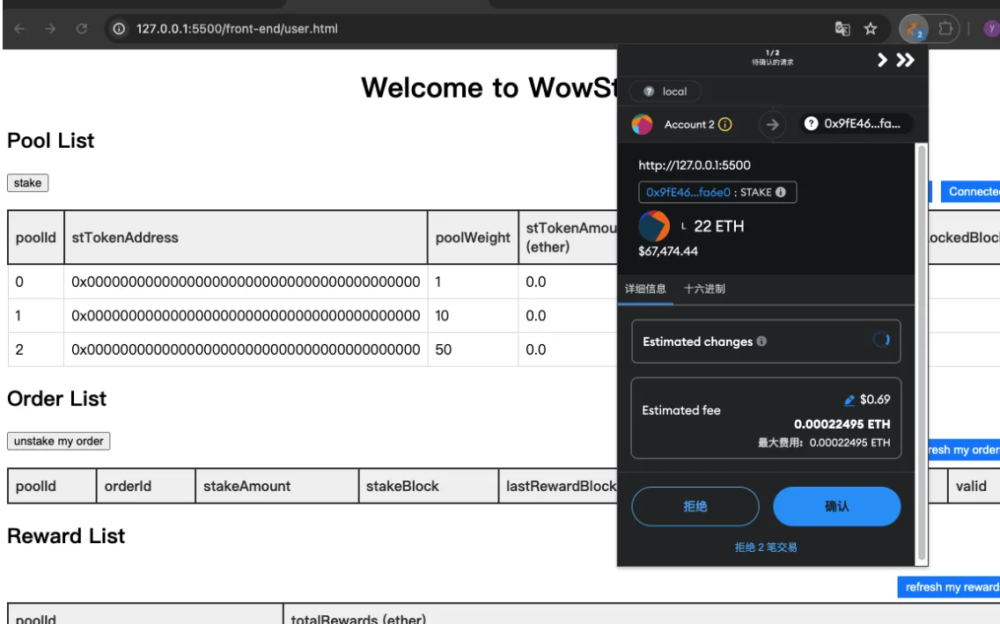
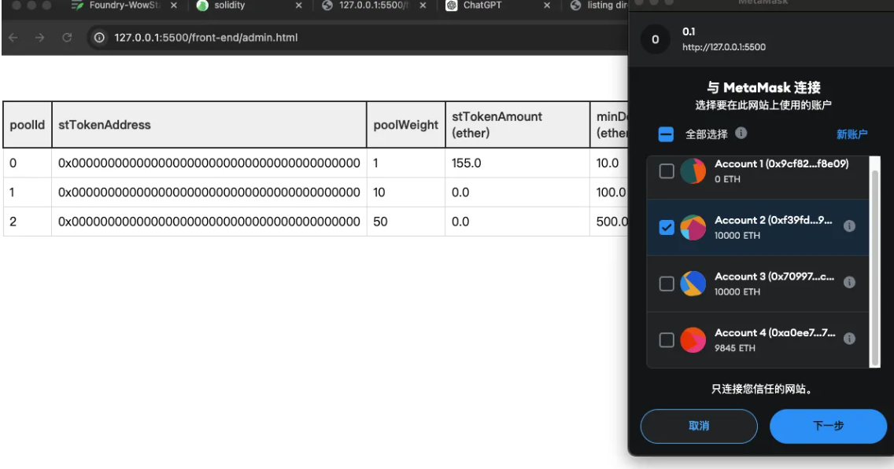

# Foundry-WowStake

## 1 : 普通用户界面 

### 1.1  stake 

用户可以选择在已有的pool里面 质押 

质押之后 可以查看订单 并且刷新可以看到预期的奖励

### 1.2 unstake 

用户可以根据order或者pool来取消质押

取消质押之后 会获得奖励 order状态会变成无效

并且pool里面的质押总额也会减小

  

用户可以看到自己每个池子获得奖励当总额

## 2 admin 页面

  

### 2.1 add pool

  

切换admin 用户

## 3 ToDo 

3.1 admin 关闭池子，修改池子信息

3.2 合约升级

## 4 覆盖率 

